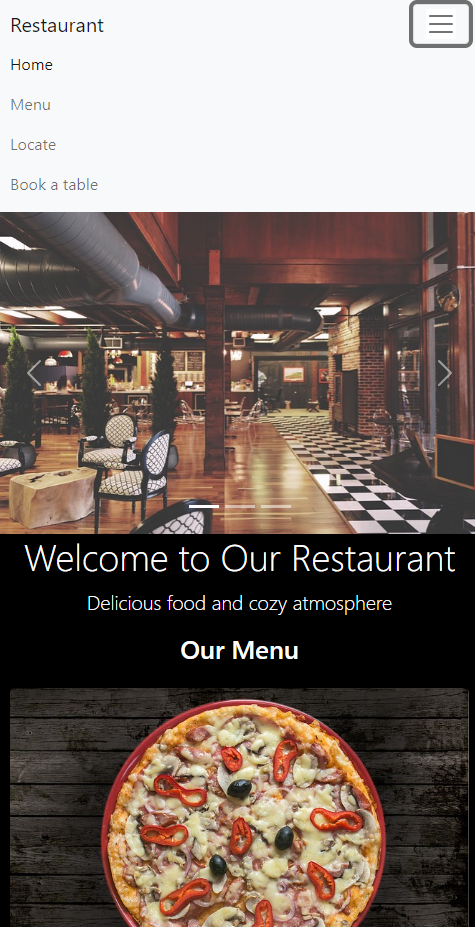
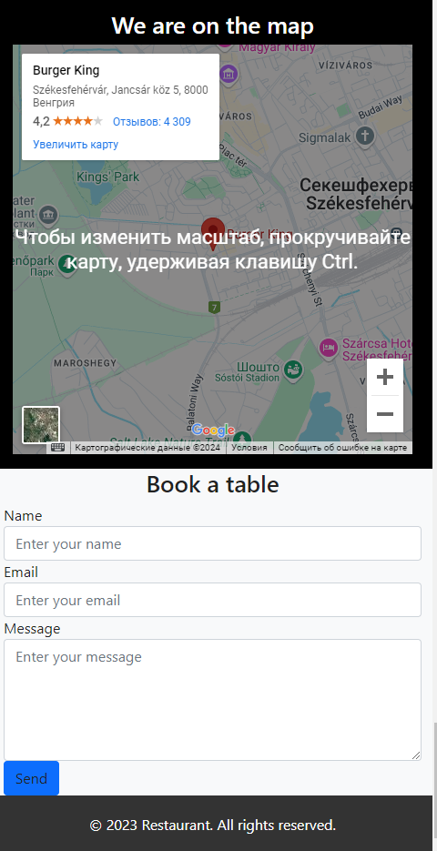

# 🍽️ Restaurant Website


Welcome to the **Restaurant** website project! 🍕 This is a modern, responsive single-page website created using **HTML**, **CSS**, and **Bootstrap**. 🚀 It doesn't use any JavaScript and focuses on delivering a clean, user-friendly experience. 😎

## 📸 Screenshots

Here's a sneak peek at the design:

## 📸 Screenshots

| Screenshot 1 | Screenshot 2 |
|---------------|---------------|
|  |  |


## 📝 About the Project

This project is part of my **portfolio**, showcasing my ability to create responsive and visually appealing websites. 🎨 The design focuses on user experience and is optimized for all devices, including mobile, tablet, and desktop. 📱💻

### 💻 Technologies Used
  
  
  [](https://github.com/harish-sethuraman/readme-components)
## 🚀 How to View the Project

To view the website on your local machine:

1. Clone the repository:
   ```bash
   git clone https://github.com/dmutro76/restourant-portfolio.git
